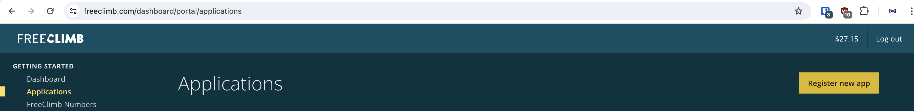
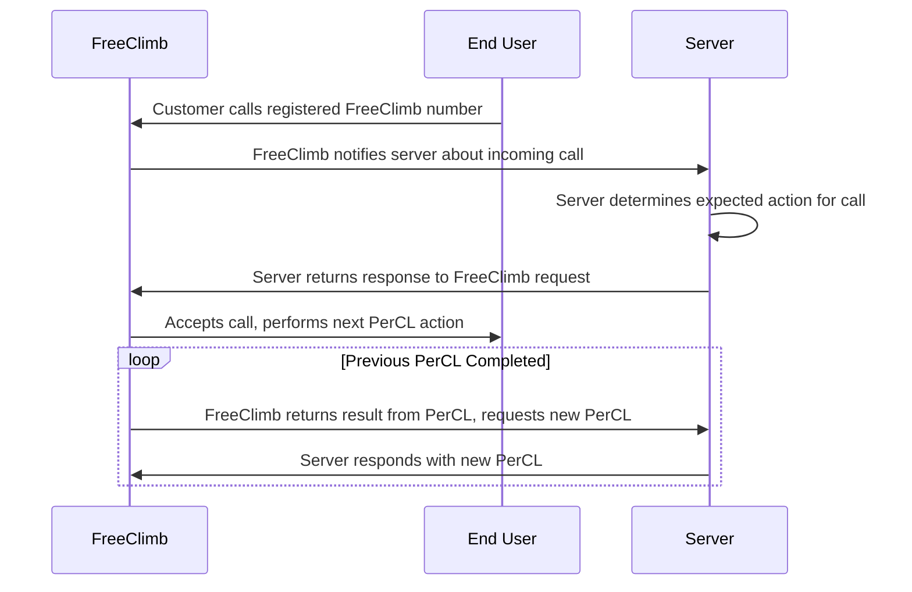

# apidays-example
Worked example from API Days (New York) Omnichannel workshop
Starting from a locally hosted instance of [privateGPT](https://github.com/zylon-ai/private-gpt), we will host and run [FreeClimb](https://www.freeclimb.com) application that provides the same experience via SMS, Voice, and (presuming available time) a simple web form.

This repository includes a [simple example constructed ahead of time](apidays/example.py) as well as the code that was created during the actual process of the demo. In addition a [script](setup.sh) that attempts to setup privateGPT for the demo is provided, without any guarantees as to accuracy or functionality.

## Steps to setup FreeClimb Application

1. Create FreeClimb Account <https://freeclimb.com/dashboard/login/>
2. Register a new FreeClimb Application 
3. Setup Voice Callback, SMS Callback, and Status Callback with server URL (ngrok or other means of exposing an application)
4. Purchase a FreeClimb phone number and assign to the FreeClimb Application created in step 2
5. Verify your server is receiving traffic when calling and texting the number

## FreeClimb Application Flow

## Useful Links

- [FreeClimb Reference Documentation](https://docs.freeclimb.com/reference/api-reference-overview)
- [FreeClimb Python SDK](https://github.com/FreeClimbAPI/python-sdk)
- [FreeClimb Voice Quickstart](https://github.com/FreeClimbAPI/Python-Voice-Quickstart)
- [FreeClimb SMS Quickstart](https://github.com/FreeClimbAPI/Python-SMS-Quickstart)
- [privateGPT Installation](https://docs.privategpt.dev/installation/getting-started/main-concepts)
